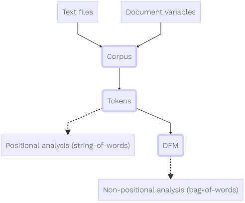

```{r setup, include = FALSE}

library(tidyverse)
library(quanteda)
library(knitr)
library(kableExtra)

DLAndUnzipData <- function(data.filename = "Coursera-SwiftKey.zip") {
  # Downloads and unzips the capstone dataset if needed, returns folder name
  #
  # Args:
  #   data.filename: An optional name for the zip file, to replace the default
  #
  # Returns:
  #   A chacacter value of the name of the folder containing the data

  # Check if the file already exists, download if it does not
  if (!file.exists(data.filename)) {
    print("Downloading Data File")
    url <- paste0("https://d396qusza40orc.cloudfront.net/dsscapstone/dataset/",
                  "Coursera-SwiftKey.zip")
    download.file(url, data.filename)
  }
  
  # Check if the file is already unzipped, unzip if needed
  data.folder <- "final"
  if (!file.exists(data.folder)) {
    print("Unzipping Data File")
    unzip(data.filename)
  }
  return(data.folder)  # Return directory of unzipped file contents as character
}

AssembleCorpus <- function(n.lines,
                           file.selection = c("blogs", "news", "twitter"),
                           sub.dir = c("en_US", "de_DE", "fi_FI", "ru_RU")) {
  # Reads in specified number of lines from the specified file, assembles corpus
  #
  # Args:
  #   n.lines: The number of lines to read in from the text with readLines()
  #   file: Select which file to read from, one of: blogs, news, or twitter
  #   sub.dir: The subdirectory to read in files from, "en_US" by default
  #
  # Returns:
  #   A corpus of the text from the selected file, one "text" per line
  
  # Check and set arguments
  file.selection <- match.arg(file.selection)
  sub.dir <- match.arg(sub.dir)

  # Download and unzip the data, store folder name and file path
  filename <- paste(sub.dir, file.selection, "txt", sep = ".")  # Make file name
  filepath <- file.path(DLAndUnzipData(), sub.dir, filename)  # Build file path
  file.corpus <- filepath %>%
    readLines(n = n.lines) %>%  # Read in text
    corpus()  # Convert to corpus
  
  # Set metadata for the corpus
  docnames(file.corpus) <- paste0(file.selection, 1:ndoc(file.corpus))
  file.corpus$metadata$source <- filename
  file.corpus$metadata$file.size <- file.info(filepath)$size
  file.corpus$metadata$rows.read <- ndoc(file.corpus)
  
  # Return the corpus
  return(file.corpus)
}

AssembleSummary <- function(corpus.object) {
  # Assembles a data frame from the metadata of a corpus
  #
  # Args:
  #   corpus.object: The corpus from which to extract the metadata
  #
  # Returns:
  #   A data frame of the metadata
  
  # Extract metadata from corpus and convert to data frame
  corpus.metadata <- corpus.object %>%
    metacorpus() %>%
    as.data.frame(stringsAsFactors = FALSE)
  
  # Return the metadata as a data frame
  return(corpus.metadata)
}

FindWordsNeeded <- function(fraction, dataframe) {
  # Finds number of words needed to cover the specified fraction of occurances
  #
  # Args:
  #   fraction: the coverage fraction of interest
  #   dataframe: dataframe object from dfm and modified with cumulative vars
  #
  # Returns:
  #   The number of words needed to cover the specified fraction
dataframe %>%
    filter(cum.frac <= fraction) %>%
    nrow()
}

```


## Overview

This is the first milestone report for my word prediction project which is for
the capstone project of the Data Science Specialization from Johns Hopkins
University on Coursera. The ultimate goal of the project is to create an
application that uses a model to predict which word comes next based on a
sequence of input words. The instructions for this milestone report say to
create an HTML report which summarizes the text files that will eventually form
the basis of the predictive model. The report should include figures that show
interesting features identified during exploratory data analysis.

The data for this project were downloaded through the course website and
pre-processed in RStudio. The data were then explored for interesting features
that will guide the remaining portions of the project. The `quanteda` and
`tidyverse` packages were used for much of the data processing. Additional
information such as the full instructions, raw data, initial script, and the
R Markdown file that produced this report can be found in the [GitHub repo][1]
for this project.

[1]: xxxxx "GitHub repo for project"


## Introduction

A core part of the broader project is to create a predictive text model, and an
effective model should have a large and diverse sample dataset to train on. The
course provides a large dataset which was obtained with a web crawler, and the
sources include: blogs, news articles, and Twitter. Data were collected in four
languages, but this project will only focus on English data. The table below
summarizes the three files that were provided in the English language. 

```{r load.data1, include = FALSE, cache = TRUE}

# Set how many lines to read in from the text files
chunk.size <- 30000  # A negative number reads all lines

# Read in text data and assemble into 3 corpora
blogs.corp <- AssembleCorpus(n.lines = chunk.size, file.selection = "blogs")
news.corp <- AssembleCorpus(n.lines = chunk.size, file.selection = "news")
twitter.corp <- AssembleCorpus(n.lines = chunk.size, file.selection = "twitter")

# Tokenize and clean text
# The predictive model will not attempt to predict: numbers, punctuation,
# symbols, twitter handles, hyphens, or urls, so these are all removed
blogs.tkn <- tokens(blogs.corp, remove_numbers = T, remove_punct = T,
                    remove_symbols = T, remove_twitter = T, remove_hyphens = T,
                    remove_url = T)
news.tkn <- tokens(news.corp, remove_numbers = T, remove_punct = T,
                    remove_symbols = T, remove_twitter = T, remove_hyphens = T,
                    remove_url = T)
twitter.tkn <- tokens(twitter.corp, remove_numbers = T, remove_punct = T,
                    remove_symbols = T, remove_twitter = T, remove_hyphens = T,
                    remove_url = T)

# Count the number of words in each token object and add to the corpus metadata
blogs.corp$metadata$word.count <- sum(ntoken(blogs.tkn))
news.corp$metadata$word.count <- sum(ntoken(news.tkn))
twitter.corp$metadata$word.count <- sum(ntoken(twitter.tkn))

```

```{r print.table, echo = FALSE, cache = TRUE}

# Construct a table that summarizes the corpora
summary.table <- bind_rows(AssembleSummary(blogs.corp),
                           AssembleSummary(news.corp),
                           AssembleSummary(twitter.corp))

# Update formatting of the table
summary.table <- summary.table %>%
  select(-created) %>%
  mutate(file.size = round(file.size / (1024 ^ 2), 1))

# Print the output table
column.names <- c("File Name", "File Size [Mb]", "Number of Lines",
                  "Number of Words")
kable(summary.table, col.names = column.names) %>%
  kable_styling(full_width = FALSE)

```

The table shows that the combined file size is over 500 Mb, so care must be
taken since this data could strain the memory and processing resources of a
computer. The word count listed in the table is after some light pre-processing
which removed some elements like numbers, urls, and twitter handles. Elements
like these can be removed since the predictive model will not attempt to predict
these types of features.

The [quanteda tutorial site][2] has a great image (shown below) which shows how
a typical natural language processing workflow might progress when using the
`quanteda` package.

[2]: https://tutorials.quanteda.io/ "quanteda tutorial"

```{r workflow.image, echo = FALSE, out.width = "50%", fig.align = "center"}

# Output the image of the workflow


```

This project has so far used a similar workflow - texts were each loaded in line
by line and then processed into corpus objects. These were then tokenized, where
each line was split into individual words. During tokenization some elements
were removed as described above. The token objects were then combined into a
single object representing all of the texts, and this combined token object was
the foundation of the rest of the exploration process. This report starts with
non-positional analysis and then moves on to positional analysis.


## Non-Positional Analysis (Unigrams)

```{r unigrams.1, echo = FALSE, cache = TRUE}

# Remove unneeded objects to free up memory
rm(DLAndUnzipData, AssembleCorpus, AssembleSummary, chunk.size, blogs.corp,
   news.corp, twitter.corp, summary.table, column.names)

# Combine tokens into a single object
all.tkn <- blogs.tkn + news.tkn + twitter.tkn
rm(blogs.tkn, news.tkn, twitter.tkn)

# Build dfm of unigrams and convert to dataframe
unigram <- all.tkn %>%
  dfm() %>%
  textstat_frequency() %>%
  select(-group)  # Drop the group variable

# Get total quantity of unique words and word count
unique.words <- nrow(unigram)  # Total unique words
occurances <- sum(unigram$frequency)  # Total count of word occurances

# Add cumulative frequency and fraction to the unigram data frame
unigram <- unigram %>%
  mutate(cum.freq = cumsum(frequency),  # Add cumulative frequency column
         cum.frac = cum.freq / occurances)  # Add cumulative fraction column

```

The combined token object was then organized into a document-feature matrix, and
in this form some interesting insights can be extracted from the data. For
example, one can see that the texts contained
`r round(unique.words / 1000000, digits = 1)` million unique words with
`r round(occurances / 1000000, digits = 1)` million total occurances of words
(the word count). If the list of unique words is sorted by decreasing frequency,
one can see how the frequencies and cumulative occurance fraction change along
the word index as shown in the plots below.

```{r unigrams.2, echo = FALSE, cache = TRUE, fig.align = "center"}

# Plot unigram frequency by index
par(mfrow = c(1, 2))  # Setup plot space, 1 row, 2 columns
plot(x = 1:unique.words, y = unigram$frequency,
     xlab = "Word Index (sorted)", ylab = "Word Frequency [count]")

# Plot cumulative occurance fraction by word index
plot(x = 1:unique.words, y = unigram$cum.frac,
     xlab = "Word Index (sorted)", ylab = "Cumulative Occurance Fraction")

# Make a table for the cumulative occurance fractions and words needed
# Create a vector of desired fractions
fractions <- c(0.10, 0.20, 0.50, 0.90)
# Find the number of words needed for each fraction
words.needed <- map_int(fractions, FindWordsNeeded, dataframe = unigram)
# Assemble into dataframe
cumulative.table <- data.frame("Fraction" = fractions,
                               "Words" = words.needed)

# Output the table
kable(cumulative.table, col.names = c("Coverage Fraction", "Words Needed")) %>%
  kable_styling(full_width = FALSE)

```

The plot above on the left shows that a very small number of words occur very
frequently, and then there is a long tail of words that occur rarely. This sharp
inverse relationship is [common in NLP][3]. Similarily the plot on the right
shows how the total fraction of occurances quickly spikes and then slowly
increases as more words are included. The table above summarizes this plot by
showing how many words are needed to cover certain fractions of occurances. It
is worth taking a closer look at these most common words in the table below.

[3]: https://en.wikipedia.org/wiki/Zipf%27s_law "Wikipedia for Zipf's law"

```{r unigrams.3, echo = FALSE, cache = TRUE, fig.align = "center"}

# Prepare better variable names for the table
ngram.labels <- c("n-gram", "Frequency", "Rank", "Document Frequency")
# Display the top ten unigrams and frequencies
unigram %>%
  select(feature:docfreq) %>%
  slice(1:10) %>%
  kable(col.names = ngram.labels) %>%
  kable_styling(full_width = FALSE)

rm(cumulative.table, unigram, fractions, occurances, unique.words, words.needed,
   FindWordsNeeded)

```

The word list above is not surprising, and it is a good sign that the source
text is representative of typical English and that the processing method
functioned well. While this section only considered individual words and their
frequencies, the next section on positional analysis will consider how words
appear together.


## Positional Analysis (Bigrams and Trigrams)

```{r ngrams.1, echo = FALSE, cache = TRUE, fig.align = "center"}

# Convert the 1-gram tokens to 2-gram tokens
all.tkn.bi <- tokens_ngrams(all.tkn, n = 2)

# Build dfm of bigrams and convert to dataframe
bigram <- all.tkn.bi %>%
  dfm() %>%
  textstat_frequency() %>%
  select(-group)  # Drop the group variable
rm(all.tkn.bi)

# Store total number of bigrams
bigram.count <- nrow(bigram) / 1000000 %>%
  round(digits = 1)

```

In order to perform positional analysis the tokens object was processed into
sequences of two words - also known as bigrams. There are many more permutations
of pairs of words than there are permutations of single words. In this case
there are `r bigram.count` million bigrams. With a
long tail of low frequency features, the bigrams are more skewed than the
unigrams. Bigrams will form an important part of the predictive model since they
provide insight on how words appear together in pairs. The table below shows the
five most common bigrams in this dataset.

```{r ngrams.2, echo = FALSE, cache = TRUE, fig.align = "center"}

# Display the top ten bigrams and frequencies
bigram %>%
  slice(1:5) %>%
  kable(col.names = ngram.labels) %>%
  kable_styling(full_width = FALSE)  
rm(bigram, bigram.count)

# Convert the 1-gram tokens to 3-gram tokens
all.tkn.tri <- tokens_ngrams(all.tkn, n = 3)
rm(all.tkn)

# Build dfm of trigrams and convert to dataframe
trigram <- all.tkn.tri %>%
  dfm() %>%
  textstat_frequency() %>%
  select(-group)  # Drop the group variable
rm(all.tkn.tri)

# Store total number of trigrams
trigram.count <- nrow(trigram) / 1000000 %>%
  round(digits = 1)

```

As with the unigrams, these bigrams are expected. Lastly, the tokens object was
processed into sequences of three words - also known as trigrams. With
`r trigram.count` million trigrams it is clear
there are even more permutations than there were of bigrams, and the tail of low
frequency combinations is even longer. Trigrams will also contribute to the
model by showing how sequences of three words are likely to appear, and the
table below shows the five most common sequences.

```{r ngrams.3, echo = FALSE, cache = TRUE, fig.align = "center"}

# Display the top ten trigrams and frequencies
trigram %>%
  slice(1:5) %>%
  kable(col.names = ngram.labels) %>%
  kable_styling(full_width = FALSE) 
rm(trigram, trigram.count, ngram.labels)

```


## Plans for Algorithm and Application

Considering the size of the corpus it will be critical to efficiently store and
process the data. However, as large as the data set is, it still does not
contain all possible words let alone all possible combinations of words. Clearly
the prediction model must have a way to assign a non-zero probability to words
and sequences that were not found in the corpus. I believe a similar concept can
be applied to the long tails of low frequency n-grams that are found in the
corpus. It may be possible to assign these tails non-zero probabilities without
directly accounting for them in the model.

Additional cleaning is still needed on the data, but after that I plan to use
machine learning to train the model on a training set and evaluate it on a
validation set. I aim to find an effective sampling method that will allow the
model to train and predict on a smaller dataset. If the model can be built to
produce a vector of recommended words which are sorted by the model's estimate
of their likelihood, then the model could be evaluated both by how often it
predicts the correct word, and by how close the correct word is to being the top
prediction.

Once the model is built, a `Shiny` application will be created to predict text
using the model. For now I plan a simple text box input and an action button
which the user can click to receive the preditions for the next word. This is
less natural than an application that is continuously predicting text even while
typing, but it will reduce the amount of computation required since the model
will only make a prediction when it is instructed to do so by the action button.

